# 📊 DOKUMENTASI UML - SISTEM E-LEARNING CBT

Dokumen ini berisi diagram UML lengkap untuk Sistem Informasi E-Learning Ujian Online (Computer Based Test).

---

## 📑 DAFTAR ISI

1. [Use Case Diagram](#1-use-case-diagram)
2. [Class Diagram](#2-class-diagram)
3. [Activity Diagram](#3-activity-diagram)
4. [Sequence Diagram](#4-sequence-diagram)

---

## 1. USE CASE DIAGRAM

### 1.1 Use Case Diagram - Keseluruhan Sistem

### 1.2 Deskripsi Use Case

| No | Use Case | Aktor | Deskripsi |
|----|----------|-------|-----------|
| 1 | Login | Admin, Guru, Siswa | Masuk ke sistem dengan username & password |
| 2 | Logout | Admin, Guru, Siswa | Keluar dari sistem |
| 3 | Kelola User | Admin | CRUD akun pengguna sistem |
| 4 | Kelola Guru | Admin | CRUD data guru (NIP, nama, dll) |
| 5 | Kelola Siswa | Admin | CRUD data siswa (NISN, nama, kelas, dll) |
| 6 | Kelola Kelas | Admin | CRUD data kelas |
| 7 | Kelola Mata Pelajaran | Admin | CRUD mata pelajaran |
| 8 | Assign Guru ke Kelas | Admin | Menghubungkan guru dengan kelas & mapel |
| 9 | Kelola Pengumuman | Admin | CRUD pengumuman untuk siswa |
| 10 | Kelola Bank Soal | Admin, Guru | CRUD soal pilihan ganda |
| 11 | Kelola Ujian | Admin, Guru | CRUD ujian (jadwal, durasi, soal) |
| 12 | Lihat Hasil Ujian | Guru | Melihat nilai siswa per ujian |
| 13 | Toggle Visibility | Guru | Show/hide nilai ke siswa |
| 14 | Ambil Ujian | Siswa | Mendaftar sebagai peserta ujian |
| 15 | Mulai Ujian | Siswa | Memulai mengerjakan ujian |
| 16 | Kerjakan Ujian | Siswa | Menjawab soal-soal ujian |
| 17 | Submit Jawaban | Siswa | Mengirim jawaban (manual/auto) |
| 18 | Lihat Nilai | Siswa | Melihat nilai ujian (jika visible) |

---

## 2. CLASS DIAGRAM

### 2.1 Class Diagram - Model Utama

### 2.2 Keterangan Atribut Level User

| Level | Role | Keterangan |
|-------|------|------------|
| 11 | Admin | Full access ke semua fitur |
| 12 | Guru | Kelola ujian & soal mapel yang diampu |
| 13 | Siswa | Mengerjakan ujian & lihat nilai |

---

## 3. ACTIVITY DIAGRAM

### 3.1 Activity Diagram - Proses Login

### 3.2 Activity Diagram - Mengerjakan Ujian (Siswa)

```plantuml
@startuml Activity_Diagram_Mengerjakan_Ujian

|Siswa|
start
:Login ke Sistem;
:Akses Menu Ujian;
:Lihat Daftar Ujian Tersedia;

|Sistem|
:Tampilkan Ujian Sesuai Kelas Siswa;
:Filter: Dalam Rentang Waktu Ujian;

|Siswa|
:Pilih Ujian;
:Klik "Ambil Ujian";

|Sistem|
:Cek Waktu Ujian;
if (Dalam Rentang Waktu?) then (ya)
    :Simpan Pengambilan Ujian;
    :Tampilkan Konfirmasi;
else (tidak)
    :Tampilkan "Ujian Belum/Sudah Berakhir";
    stop
endif

|Siswa|
:Klik "Mulai Ujian";

|Sistem|
:Catat Waktu Mulai;
:Load Soal Ujian;
if (Acak Soal = True?) then (ya)
    :Randomize Urutan Soal;
else (tidak)
    :Tampilkan Urutan Normal;
endif
:Start Timer Countdown;
:Tampilkan Soal Pertama;

|Siswa|
repeat
    :Baca Soal;
    :Pilih Jawaban (A/B/C/D/E);
    :Klik Simpan/Next;
    
    |Sistem|
    :Simpan Jawaban ke Database;
    :Update Navigasi Soal;
    
    |Siswa|
repeat while (Masih Ada Soal & Waktu Tersisa?) is (ya)
-> tidak;

|Siswa|
if (Manual Submit?) then (ya)
    :Klik Tombol "Selesai";
    :Konfirmasi Submit;
else (tidak)
    |Sistem|
    :Auto Submit (Waktu Habis);
endif

|Sistem|
:Catat Waktu Selesai;
:Hitung Nilai Otomatis;
note right
    Nilai = (Jawaban Benar × Poin) 
            / Total Poin × 100
end note
:Simpan Nilai ke Database;
:Tentukan Status (Lulus/Tidak);
:Tampilkan Hasil Ujian;

|Siswa|
:Lihat Nilai & Status;
if (Nilai Visible?) then (ya)
    :Tampilkan Nilai & Detail;
else (tidak)
    :Tampilkan "Nilai Tersembunyi";
endif

stop

@enduml
```

### 3.3 Activity Diagram - Admin Membuat Ujian

### 3.4 Activity Diagram - Kelola Nilai (Guru)

---

## 4. SEQUENCE DIAGRAM

### 4.1 Sequence Diagram - Proses Login

### 4.2 Sequence Diagram - Siswa Mengerjakan Ujian

### 4.3 Sequence Diagram - Admin Membuat Ujian

### 4.4 Sequence Diagram - Toggle Visibility Nilai

---

## 📝 CATATAN PENGGUNAAN

### Cara Render Diagram PlantUML:

1. **Online**: 
   - Kunjungi https://www.plantuml.com/plantuml/uml/
   - Copy-paste kode diagram
   - Klik "Submit"

2. **VS Code Extension**:
   - Install extension "PlantUML"
   - Buka file .puml atau .md dengan kode PlantUML
   - Tekan `Alt + D` untuk preview

3. **Export ke Image**:
   - Gunakan PlantUML online untuk download PNG/SVG
   - Atau gunakan command line: `java -jar plantuml.jar diagram.puml`

### Tools Alternatif:

- **Draw.io** (https://draw.io) - Manual drawing
- **Lucidchart** - Professional diagrams
- **StarUML** - UML modeling tool
- **Visual Paradigm** - Full UML suite

---

## 📚 REFERENSI

- Laravel 8.x Documentation
- UML 2.5 Specification
- PlantUML Language Reference

---

*Dokumen ini dibuat untuk Sistem E-Learning CBT - Laravel*
*Last Updated: January 2026*
